# Software Requirements Specification (SRS)  
## Hệ thống Quản lý Nhà hàng (Restaurant Management System - RMS)

> **Phạm vi tài liệu:** Bản SRS cập nhật theo hiện trạng dự án `HN_CNTT2_Project_Holiday` (Spring Boot 4.x, Java 17, MySQL, Thymeleaf/React-ready, Cloudinary, VietQR).

## Mục lục
- [1. GIỚI THIỆU](#1-giới-thiệu)
  - [1.1 Mục đích tài liệu](#11-mục-đích-tài-liệu)
  - [1.2 Phạm vi tài liệu](#12-phạm-vi-tài-liệu)
  - [1.3 Tổng quan ứng dụng](#13-tổng-quan-ứng-dụng)
  - [1.4 Thuật ngữ viết tắt](#14-thuật-ngữ-viết-tắt)
- [2. YÊU CẦU TỔNG THỂ](#2-yêu-cầu-tổng-thể)
  - [2.1 Sơ đồ ERD](#21-sơ-đồ-erd)
  - [2.2 Sơ đồ Use Case tổng thể](#22-sơ-đồ-use-case-tổng-thể)
  - [2.3 Sơ đồ luồng tổng quát](#23-sơ-đồ-luồng-tổng-quát)
  - [2.4 Sơ đồ chuyển trạng thái hóa đơn](#24-sơ-đồ-chuyển-trạng-thái-hóa-đơn)
  - [2.5 Phân quyền hệ thống](#25-phân-quyền-hệ-thống)
  - [2.6 Site Map](#26-site-map)
- [3. CHỨC NĂNG CHI TIẾT (7 USE CASES)](#3-chức-năng-chi-tiết-7-use-cases)
  - [3.1 UC-01: Đặt bàn & Sơ đồ bàn](#31-uc-01-đặt-bàn--sơ-đồ-bàn)
  - [3.2 UC-02: Gọi món tại bàn (Order Entry)](#32-uc-02-gọi-món-tại-bàn-order-entry)
  - [3.3 UC-03: Điều phối chế biến tại bếp (KDS)](#33-uc-03-điều-phối-chế-biến-tại-bếp-kds)
  - [3.4 UC-04: Thanh toán & In hóa đơn (POS Billing)](#34-uc-04-thanh-toán--in-hóa-đơn-pos-billing)
  - [3.5 UC-05: Quản lý kho nguyên liệu](#35-uc-05-quản-lý-kho-nguyên-liệu)
  - [3.6 UC-06: Cấu hình thực đơn & giá](#36-uc-06-cấu-hình-thực-đơn--giá)
  - [3.7 UC-07: Xem báo cáo doanh thu](#37-uc-07-xem-báo-cáo-doanh-thu)
- [4. COMPONENT, THÔNG BÁO, CẢNH BÁO](#4-component-thông-báo-cảnh-báo)
- [5. LINK ISSUE](#5-link-issue)

---

## 1. GIỚI THIỆU

### 1.1 Mục đích tài liệu
Tài liệu này mô tả đầy đủ yêu cầu nghiệp vụ, yêu cầu hệ thống, luồng xử lý và phạm vi triển khai cho **RMS** nhằm đồng bộ giữa nhóm phát triển, kiểm thử, vận hành và stakeholders.

### 1.2 Phạm vi tài liệu
Tài liệu bao gồm:
- Yêu cầu tổng thể và mô hình dữ liệu.
- 7 Use Case trọng tâm từ vận hành bàn đến thanh toán và báo cáo.
- Định nghĩa phân quyền, thông báo hệ thống, cấu trúc màn hình.
- Ràng buộc kỹ thuật cho stack hiện tại.

### 1.3 Tổng quan ứng dụng
RMS là hệ thống quản lý nhà hàng hỗ trợ quy trình khép kín:
1. Quản lý bàn (mở bàn, giữ bàn, dọn bàn).
2. Gọi món tại bàn hoặc qua QR.
3. Điều phối chế biến tại bếp theo FIFO.
4. Thanh toán tại POS, hỗ trợ **tiền mặt / thẻ / VietQR**, áp mã giảm giá, tách hóa đơn.
5. Quản lý kho nguyên liệu và định mức món.
6. Quản lý thực đơn, hình ảnh món qua Cloudinary.
7. Theo dõi doanh thu và top món bán chạy.

**Stack hệ thống:**
- **Backend:** Spring Boot (Java 17)
- **Database:** MySQL
- **Frontend:** Thymeleaf (hiện tại) / React (mở rộng)
- **Integration:** Cloudinary + VietQR

### 1.4 Thuật ngữ viết tắt

| Viết tắt | Ý nghĩa |
|---|---|
| SRS | Software Requirements Specification |
| RMS | Restaurant Management System |
| ERD | Entity Relationship Diagram |
| UC | Use Case |
| POS | Point of Sale |
| KDS | Kitchen Display System |
| QR | Quick Response |
| VAT | Value Added Tax |
| FIFO | First In, First Out |

---

## 2. YÊU CẦU TỔNG THỂ

### 2.1 Sơ đồ ERD

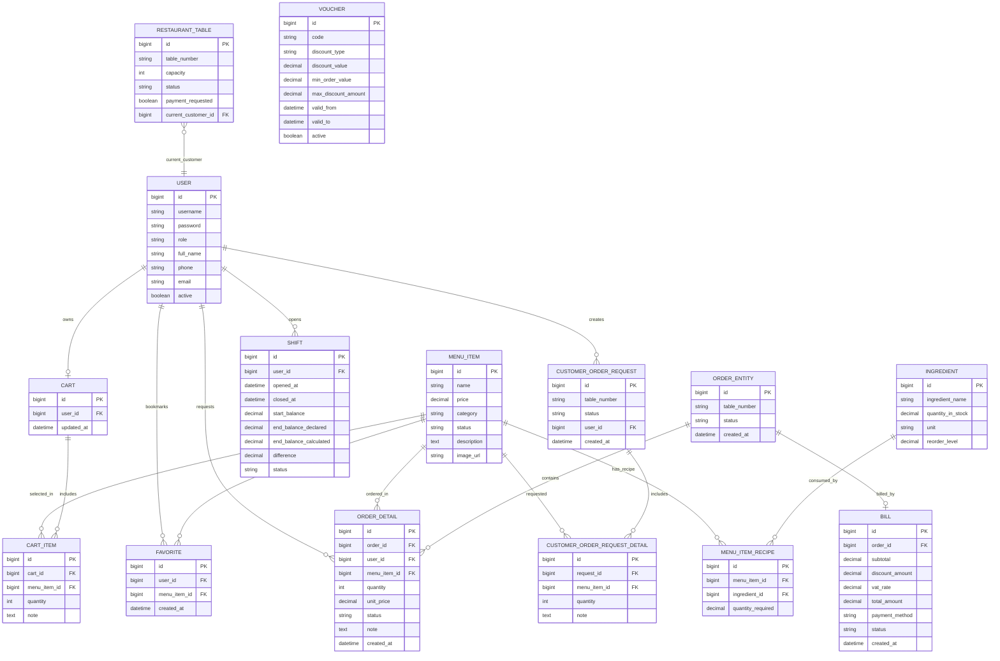

### 2.2 Sơ đồ Use Case tổng thể

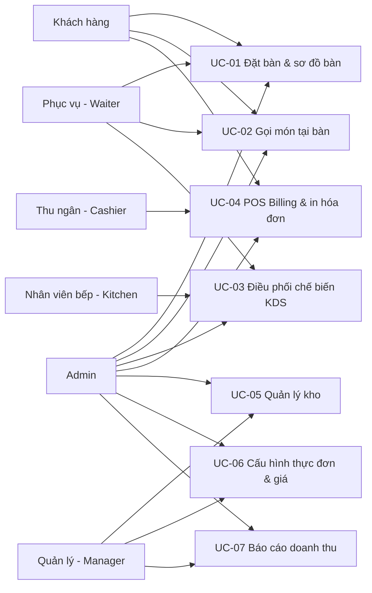

### 2.3 Sơ đồ luồng tổng quát

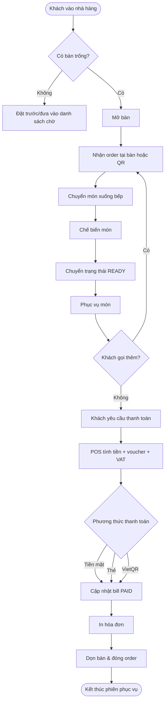

### 2.4 Sơ đồ chuyển trạng thái hóa đơn

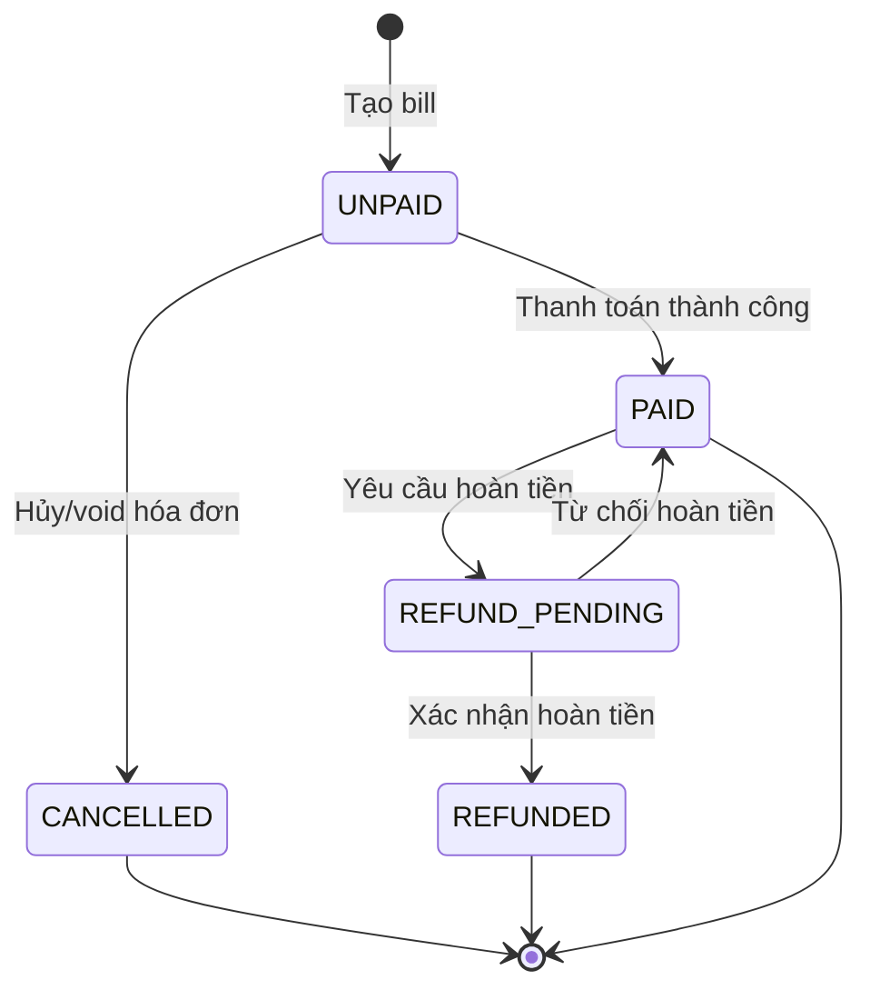

### 2.5 Phân quyền hệ thống

| Chức năng | Admin | Manager | Cashier | Waiter | Kitchen |
|---|:---:|:---:|:---:|:---:|:---:|
| Quản lý người dùng | ✓ |  |  |  |  |
| Quản lý bàn | ✓ | ✓ |  | ✓ |  |
| Tạo/Cập nhật order tại bàn | ✓ |  |  | ✓ |  |
| Duyệt yêu cầu QR | ✓ |  |  | ✓ |  |
| Cập nhật trạng thái nấu | ✓ |  |  |  | ✓ |
| Thanh toán & in hóa đơn | ✓ | ✓ | ✓ |  |  |
| Tách hóa đơn | ✓ | ✓ | ✓ |  |  |
| Quản lý kho nguyên liệu | ✓ | ✓ |  |  |  |
| Quản lý menu & định mức | ✓ | ✓ |  |  |  |
| Quản lý voucher | ✓ | ✓ | ✓ |  |  |
| Xem dashboard doanh thu | ✓ | ✓ |  |  |  |

> **Ghi chú:** Role *Manager* là lớp nghiệp vụ quản trị vận hành; trong triển khai hiện tại có thể được ánh xạ bởi quyền Admin hoặc role mở rộng.

### 2.6 Site Map

```mermaid
flowchart TB
    ROOT[/RMS/]
    ROOT --> AUTH[Đăng nhập/Đăng ký]
    ROOT --> POS[Khối POS vận hành]
    ROOT --> ADMIN[Khối Admin]
    ROOT --> CUSTOMER[Khối Khách hàng]

    POS --> TBL[/tables]
    POS --> ORD[/order/{tableNumber}]
    POS --> KIT[/kitchen]
    POS --> POSPAY[/admin/pos]

    ADMIN --> DASH[/admin/dashboard]
    ADMIN --> USR[/admin/users]
    ADMIN --> MENU[/admin/menu]
    ADMIN --> INV[/admin/inventory]
    ADMIN --> VOU[/admin/vouchers]
    ADMIN --> BILLH[/admin/bills]

    CUSTOMER --> UMENU[/user/menu]
    CUSTOMER --> FCART[/user/cart]
    CUSTOMER --> FFAV[/user/favorites]
    CUSTOMER --> PROF[/user/profile]
    CUSTOMER --> QRO[/qr/order/{tableNumber}]
```

---

## 3. CHỨC NĂNG CHI TIẾT (7 USE CASES)

### 3.1 UC-01: Đặt bàn & Sơ đồ bàn

#### 3.1.1 Đặc tả Use Case

| Thuộc tính | Giá trị |
|---|---|
| Use Case ID | UC-01 |
| Tên chức năng | Đặt bàn & Sơ đồ bàn |
| Mô tả | Quản lý trạng thái bàn: trống, đang phục vụ, đã đặt trước; mở/giữ/dọn bàn |
| Tác nhân | Waiter, Admin, Manager |
| Trigger | Khách vào quán hoặc yêu cầu đặt/chuyển trạng thái bàn |
| Điều kiện tiên quyết | Người dùng đã đăng nhập, có quyền quản lý bàn |
| Hậu điều kiện | Trạng thái bàn và order đang hoạt động được cập nhật nhất quán |

**Luồng cơ bản:**
1. Nhân viên mở màn hình sơ đồ bàn.
2. Chọn bàn trống.
3. Nhập số khách và mở bàn.
4. Hệ thống chuyển bàn sang `OCCUPIED`.
5. Cho phép điều hướng sang màn hình gọi món.

**Luồng thay thế:**
- A1: Đặt trước bàn → trạng thái `RESERVED`.
- A2: Dọn bàn khi hoàn tất thanh toán → trạng thái `EMPTY`.

**Luồng ngoại lệ:**
- E1: Bàn không tồn tại hoặc đang bị khóa trạng thái.
- E2: Bàn chưa thanh toán nhưng yêu cầu dọn bàn.

**Ràng buộc:**
- Không cho mở cùng lúc 2 order active trên cùng bàn.
- Dọn bàn cần đảm bảo không còn món active.

**Yêu cầu phi chức năng:**
- Tải sơ đồ bàn < **2 giây** với 100 bàn.

#### 3.1.2 Sơ đồ Use Case phân rã

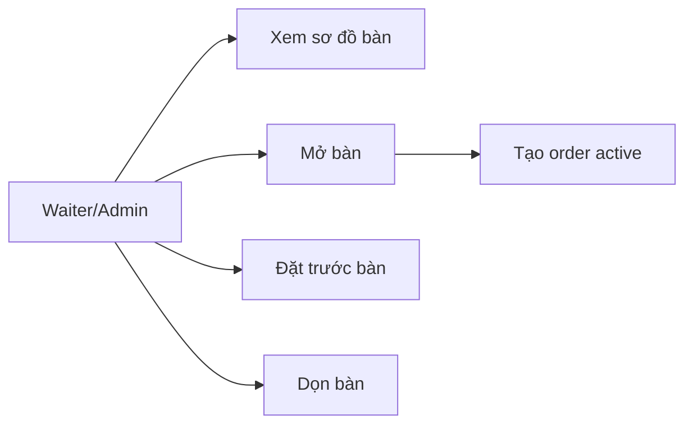

#### 3.1.3 Sơ đồ tuần tự (Sequence)

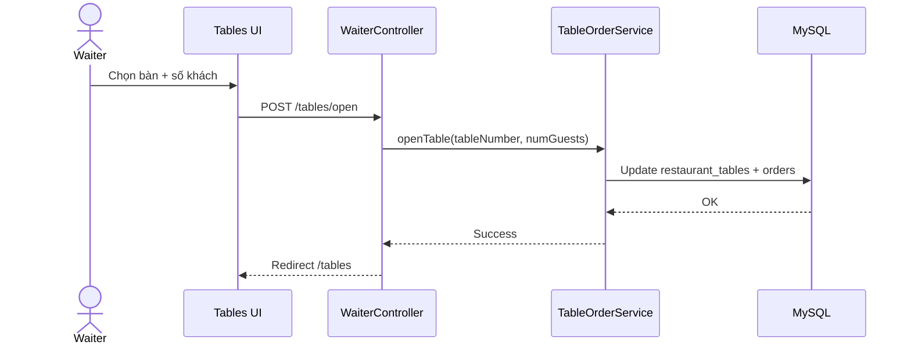

#### 3.1.4 Mô tả giao diện
- Màn hình dạng grid thể hiện trạng thái bàn bằng màu.
- Khối cảnh báo yêu cầu QR đang chờ duyệt.
- Nút thao tác nhanh: **Mở bàn**, **Giữ bàn**, **Dọn bàn**, **Vào order**.

#### 3.1.5 Mô tả chi tiết dữ liệu

| Tên tiếng Việt | Tên tiếng Anh | Loại | Bắt buộc | Mô tả |
|---|---|---|---|---|
| Mã bàn | tableNumber | String | Có | Định danh bàn duy nhất |
| Sức chứa | capacity | Integer | Có | Số khách tối đa |
| Trạng thái bàn | status | Enum | Có | EMPTY/OCCUPIED/RESERVED |
| Yêu cầu thanh toán | paymentRequested | Boolean | Có | Cờ khách yêu cầu tính tiền |

---

### 3.2 UC-02: Gọi món tại bàn (Order Entry)

#### 3.2.1 Đặc tả Use Case

| Thuộc tính | Giá trị |
|---|---|
| Use Case ID | UC-02 |
| Tên chức năng | Gọi món tại bàn |
| Mô tả | Nhập món từ nhân viên hoặc yêu cầu QR và chuyển xuống bếp |
| Tác nhân | Waiter, Customer (QR), Admin |
| Trigger | Khách chọn món |
| Điều kiện tiên quyết | Bàn đang `OCCUPIED` hoặc có request QR hợp lệ |
| Hậu điều kiện | Tạo/cập nhật `Order` + `OrderDetail` ở trạng thái PENDING |

**Luồng cơ bản:**
1. Chọn bàn và mở trang order.
2. Chọn món, số lượng, ghi chú.
3. Gửi order.
4. Hệ thống tạo `OrderDetail` và chuyển xuống bếp.

**Luồng thay thế:**
- A1: Khách gửi request qua QR, waiter duyệt trước khi đẩy vào bếp.
- A2: Cập nhật trạng thái từng món bởi waiter khi phục vụ.

**Luồng ngoại lệ:**
- E1: Món `OUT_OF_STOCK`.
- E2: Bàn chưa mở nhưng yêu cầu gọi món.

**Ràng buộc:**
- Món phải tồn tại trong menu và khả dụng.

**Yêu cầu phi chức năng:**
- Trả phản hồi gửi món dưới **500ms** cho yêu cầu thông thường.

#### 3.2.2 Sơ đồ Use Case phân rã

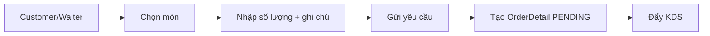

#### 3.2.3 Sơ đồ tuần tự (Sequence)

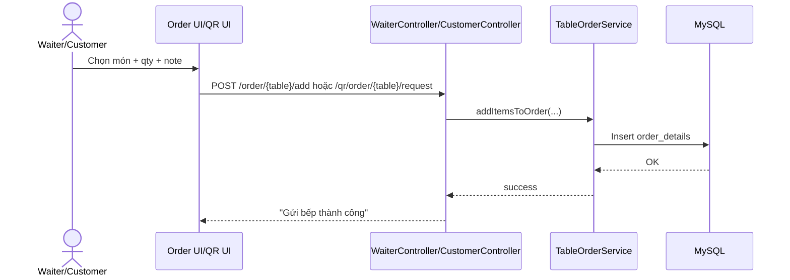

#### 3.2.4 Mô tả giao diện
- Danh sách món theo category, giá và trạng thái món.
- Giỏ gọi món theo bàn, hiển thị món đã gửi.
- QR page tối ưu cho điện thoại, không bắt buộc đăng nhập.

#### 3.2.5 Mô tả chi tiết dữ liệu

| Tên tiếng Việt | Tên tiếng Anh | Loại | Bắt buộc | Mô tả |
|---|---|---|---|---|
| Mã đơn hàng | orderId | Long | Có | Đơn active theo bàn |
| Mã món | menuItemId | Long | Có | Món được gọi |
| Số lượng | quantity | Integer | Có | >0 |
| Ghi chú bếp | note | String | Không | Ít cay, không hành... |
| Trạng thái món | status | Enum | Có | PENDING/COOKING/READY/SERVED |

---

### 3.3 UC-03: Điều phối chế biến tại bếp (KDS)

#### 3.3.1 Đặc tả Use Case

| Thuộc tính | Giá trị |
|---|---|
| Use Case ID | UC-03 |
| Tên chức năng | Điều phối chế biến tại bếp |
| Mô tả | Bếp nhận món chờ và cập nhật trạng thái chế biến |
| Tác nhân | Kitchen, Admin |
| Trigger | Có order detail mới ở trạng thái PENDING |
| Điều kiện tiên quyết | User có quyền bếp |
| Hậu điều kiện | Trạng thái món chuyển đúng luồng và waiter thấy món READY |

**Luồng cơ bản:**
1. Bếp mở màn hình KDS.
2. Hệ thống tải danh sách món active theo FIFO.
3. Bếp chuyển trạng thái `PENDING -> COOKING -> READY`.
4. Waiter nhận thông tin món READY để phục vụ.

**Luồng thay thế:**
- A1: Món bị hủy: `CANCELLED`.

**Luồng ngoại lệ:**
- E1: Cập nhật sai trạng thái hợp lệ.

**Ràng buộc:**
- Không cho nhảy trạng thái sai thứ tự nghiệp vụ.

**Yêu cầu phi chức năng:**
- Màn hình KDS cập nhật realtime/polling tối đa 5 giây.

#### 3.3.2 Sơ đồ Use Case phân rã

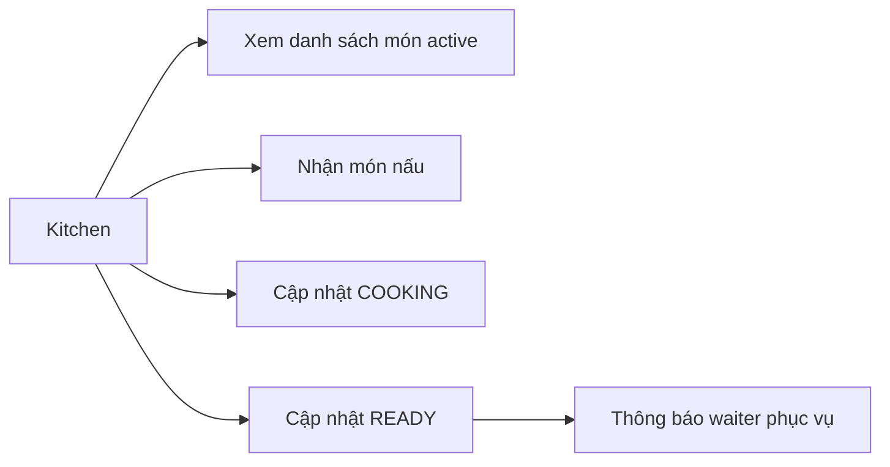

#### 3.3.3 Sơ đồ tuần tự (Sequence)

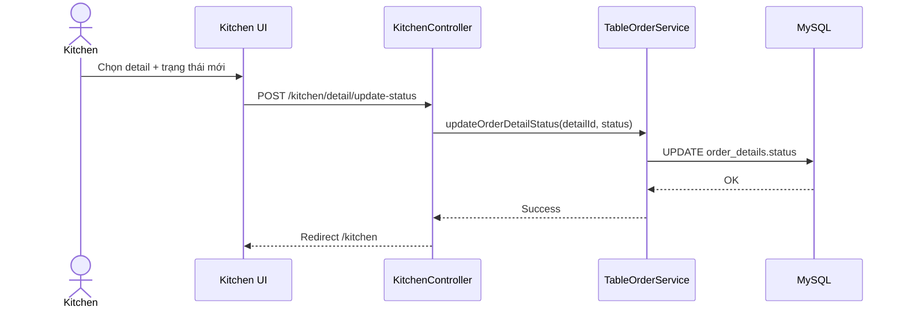

#### 3.3.4 Mô tả giao diện
- Danh sách món theo thứ tự thời gian tạo.
- Badge trạng thái nổi bật: PENDING/COOKING/READY.
- Nút thao tác nhanh chuyển trạng thái.

#### 3.3.5 Mô tả chi tiết dữ liệu

| Tên tiếng Việt | Tên tiếng Anh | Loại | Bắt buộc | Mô tả |
|---|---|---|---|---|
| Mã chi tiết món | detailId | Long | Có | Định danh món trong order |
| Mã bàn | tableNumber | String | Có | Bàn phục vụ |
| Trạng thái bếp | status | Enum | Có | PENDING/COOKING/READY/CANCELLED |
| Thời điểm tạo | createdAt | DateTime | Có | Ưu tiên FIFO |

---

### 3.4 UC-04: Thanh toán & In hóa đơn (POS Billing)

#### 3.4.1 Đặc tả Use Case

| Thuộc tính | Giá trị |
|---|---|
| Use Case ID | UC-04 |
| Tên chức năng | Thanh toán & in hóa đơn |
| Mô tả | Tính tiền, áp voucher, chọn phương thức thanh toán, in bill |
| Tác nhân | Cashier, Admin, Manager |
| Trigger | Khách yêu cầu thanh toán |
| Điều kiện tiên quyết | Order đã có món, bàn yêu cầu thanh toán |
| Hậu điều kiện | Bill chuyển PAID, order đóng và bàn sẵn sàng dọn |

**Luồng cơ bản:**
1. Thu ngân chọn order cần thanh toán.
2. Hệ thống tính subtotal.
3. Áp voucher (nếu có), VAT.
4. Chọn phương thức: CASH/CARD/BANKING(VietQR).
5. Xác nhận thanh toán và in hóa đơn.

**Luồng thay thế (Tách hóa đơn):**
- A1: Thu ngân chọn một phần món để tách hóa đơn.
- A2: Hệ thống tạo order mới cho phần tách và thanh toán độc lập.

**Luồng ngoại lệ:**
- E1: Voucher không hợp lệ/hết hạn.
- E2: Chưa chọn món nhưng yêu cầu tách bill.

**Ràng buộc:**
- Chỉ cho checkout order active.

**Yêu cầu phi chức năng:**
- Tạo bill hoàn tất dưới 2 giây, đảm bảo toàn vẹn giao dịch.

#### 3.4.2 Sơ đồ Use Case phân rã

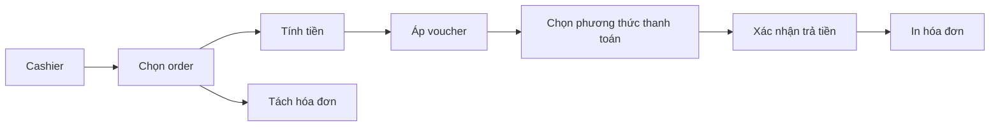

#### 3.4.3 Sơ đồ tuần tự (Sequence)

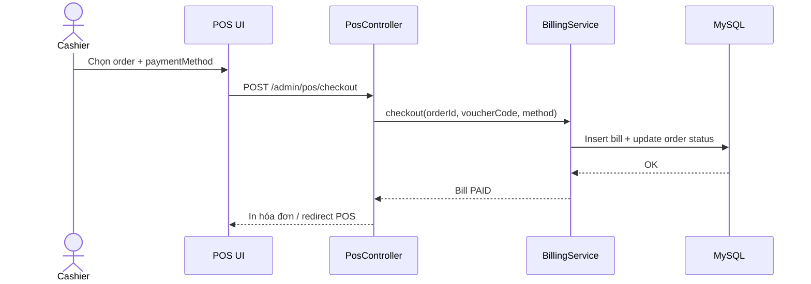

#### 3.4.4 Mô tả giao diện
- Danh sách order chưa thanh toán.
- Khối tổng tiền: tạm tính, giảm giá, VAT, tổng thanh toán.
- Popup **VietQR** hiển thị mã thanh toán động.
- Panel chọn món để **tách hóa đơn**.

#### 3.4.5 Mô tả chi tiết dữ liệu

| Tên tiếng Việt | Tên tiếng Anh | Loại | Bắt buộc | Mô tả |
|---|---|---|---|---|
| Mã hóa đơn | billId | Long | Có | Định danh hóa đơn |
| Mã đơn | orderId | Long | Có | Đơn cần thanh toán |
| Tạm tính | subtotal | Decimal | Có | Tổng trước giảm giá/VAT |
| Giảm giá | discountAmount | Decimal | Có | Giá trị giảm thực tế |
| VAT | vatRate | Decimal | Có | Tỉ lệ thuế |
| Tổng tiền | totalAmount | Decimal | Có | Số tiền cuối |
| PTTT | paymentMethod | Enum | Có | CASH/CARD/BANKING |
| Trạng thái bill | status | Enum | Có | UNPAID/PAID |

**Ví dụ JSON checkout:**
```json
{
  "orderId": 1024,
  "voucherCode": "SUMMER10",
  "paymentMethod": "BANKING",
  "splitDetailIds": [2001, 2002]
}
```

---

### 3.5 UC-05: Quản lý kho nguyên liệu

#### 3.5.1 Đặc tả Use Case

| Thuộc tính | Giá trị |
|---|---|
| Use Case ID | UC-05 |
| Tên chức năng | Quản lý kho nguyên liệu |
| Mô tả | Theo dõi tồn kho, ngưỡng cảnh báo, cập nhật nhập/xuất |
| Tác nhân | Admin, Manager |
| Trigger | Nhập hàng mới hoặc tiêu hao từ order |
| Điều kiện tiên quyết | Đăng nhập quyền quản lý kho |
| Hậu điều kiện | Số lượng tồn và cảnh báo kho được cập nhật |

**Luồng cơ bản:**
1. Mở màn hình kho.
2. Thêm mới nguyên liệu hoặc cập nhật tồn.
3. Hệ thống lưu dữ liệu và kiểm tra ngưỡng cảnh báo.

**Luồng thay thế:**
- A1: Cập nhật tồn kho hàng loạt theo phiếu nhập.

**Luồng ngoại lệ:**
- E1: Nhập số lượng âm/đơn vị không hợp lệ.

**Ràng buộc:**
- Không cho tồn kho âm sau khi trừ định mức.

**Yêu cầu phi chức năng:**
- Truy vấn danh sách kho dưới 1 giây với 10.000 bản ghi.

#### 3.5.2 Sơ đồ Use Case phân rã

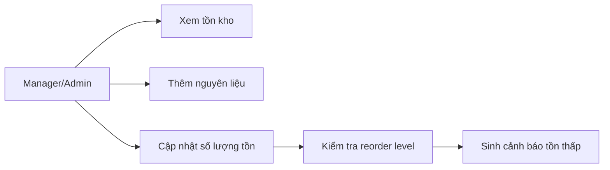

#### 3.5.3 Sơ đồ tuần tự (Sequence)

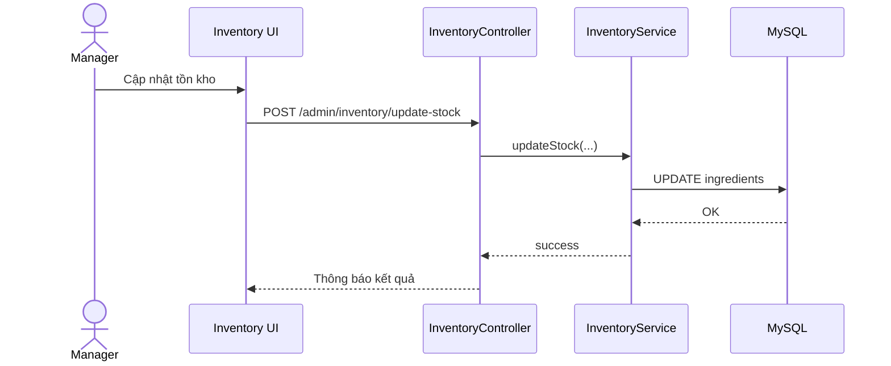

#### 3.5.4 Mô tả giao diện
- Bảng kho gồm tên, đơn vị, tồn hiện tại, ngưỡng đặt hàng.
- Cột cảnh báo màu khi tồn <= ngưỡng.
- Form cập nhật nhanh tồn kho.

#### 3.5.5 Mô tả chi tiết dữ liệu

| Tên tiếng Việt | Tên tiếng Anh | Loại | Bắt buộc | Mô tả |
|---|---|---|---|---|
| Mã nguyên liệu | ingredientId | Long | Có | Định danh nguyên liệu |
| Tên nguyên liệu | ingredientName | String | Có | Duy nhất |
| Tồn kho | quantityInStock | Decimal | Có | Số lượng còn lại |
| Đơn vị | unit | String | Có | gram/ml/chai... |
| Ngưỡng đặt hàng | reorderLevel | Decimal | Có | Mức cảnh báo |

**Ví dụ SQL kiểm tra tồn thấp:**
```sql
SELECT ingredient_name, quantity_in_stock, reorder_level
FROM ingredients
WHERE quantity_in_stock <= reorder_level
ORDER BY quantity_in_stock ASC;
```

---

### 3.6 UC-06: Cấu hình thực đơn & giá

#### 3.6.1 Đặc tả Use Case

| Thuộc tính | Giá trị |
|---|---|
| Use Case ID | UC-06 |
| Tên chức năng | Cấu hình thực đơn & giá |
| Mô tả | Quản lý món, giá bán, ảnh món, trạng thái và định mức nguyên liệu |
| Tác nhân | Admin, Manager |
| Trigger | Cập nhật menu theo mùa/chính sách giá |
| Điều kiện tiên quyết | Có quyền quản trị menu |
| Hậu điều kiện | Menu đồng bộ trạng thái và recipe định mức |

**Luồng cơ bản:**
1. Quản trị mở trang menu.
2. Thêm/sửa món, giá, mô tả.
3. Upload ảnh món qua Cloudinary.
4. Gán định mức nguyên liệu cho món.
5. Lưu và công bố trạng thái món.

**Luồng thay thế:**
- A1: Ẩn món tạm thời bằng trạng thái `OUT_OF_STOCK`.

**Luồng ngoại lệ:**
- E1: Upload ảnh lỗi hoặc dữ liệu giá không hợp lệ.

**Ràng buộc:**
- Tên món duy nhất, giá > 0.

**Yêu cầu phi chức năng:**
- Upload ảnh và trả URL thành công > 99% trong điều kiện mạng ổn định.

#### 3.6.2 Sơ đồ Use Case phân rã

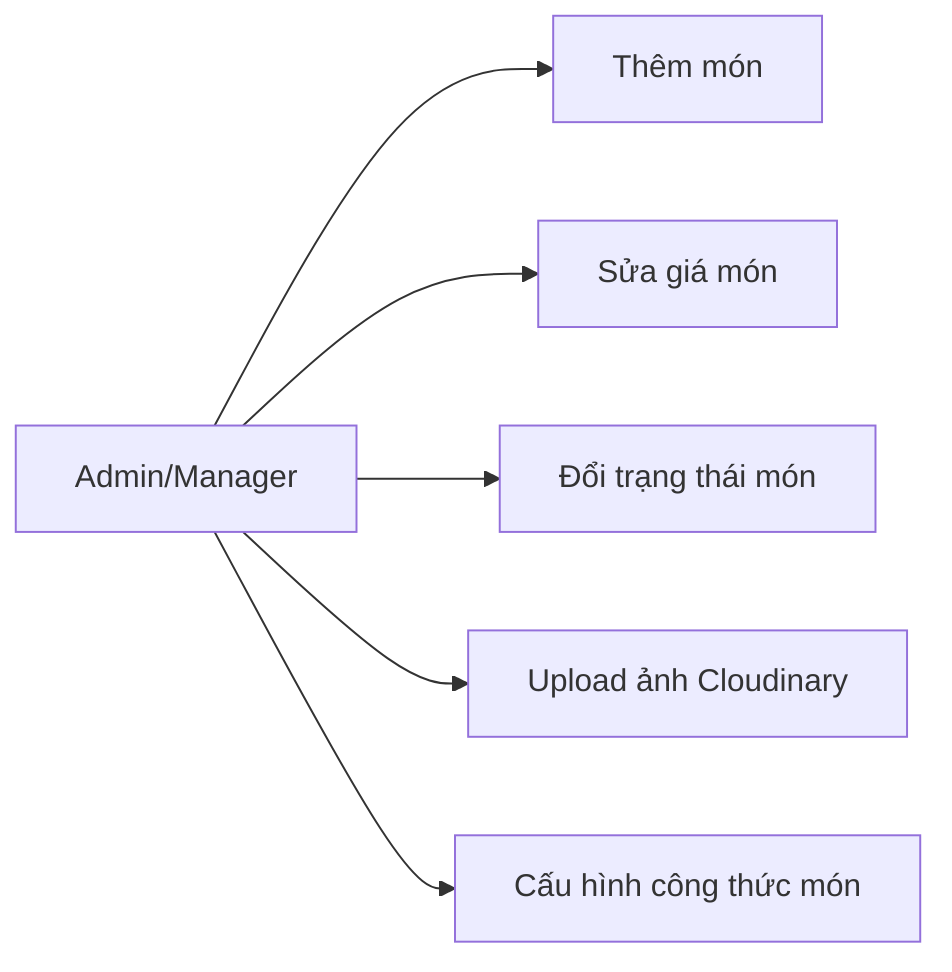

#### 3.6.3 Sơ đồ tuần tự (Sequence)

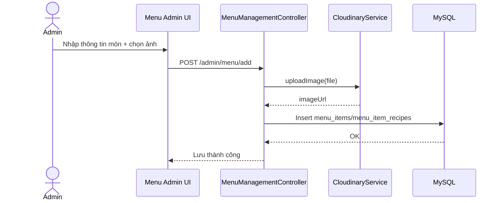

#### 3.6.4 Mô tả giao diện
- Bảng món: tên, danh mục, giá, trạng thái, ảnh.
- Form công thức món (ingredient + quantity_required).
- Nút bật/tắt khả dụng món.

#### 3.6.5 Mô tả chi tiết dữ liệu

| Tên tiếng Việt | Tên tiếng Anh | Loại | Bắt buộc | Mô tả |
|---|---|---|---|---|
| Mã món | menuItemId | Long | Có | Định danh món |
| Tên món | name | String | Có | Duy nhất |
| Giá bán | price | Decimal | Có | > 0 |
| Danh mục | category | Enum | Có | APPETIZER/MAIN/DRINK/DESSERT |
| Trạng thái món | status | Enum | Có | AVAILABLE/OUT_OF_STOCK |
| Ảnh món | imageUrl | String | Không | URL Cloudinary |

---

### 3.7 UC-07: Xem báo cáo doanh thu

#### 3.7.1 Đặc tả Use Case

| Thuộc tính | Giá trị |
|---|---|
| Use Case ID | UC-07 |
| Tên chức năng | Xem báo cáo doanh thu |
| Mô tả | Dashboard doanh thu tháng/ngày, số bill, top món, cảnh báo kho |
| Tác nhân | Admin, Manager |
| Trigger | Người dùng mở trang dashboard |
| Điều kiện tiên quyết | Có quyền xem báo cáo |
| Hậu điều kiện | Dữ liệu KPI hiển thị chính xác theo kỳ lọc |

**Luồng cơ bản:**
1. Truy cập dashboard.
2. Hệ thống tính tổng doanh thu hóa đơn `PAID` theo kỳ.
3. Hiển thị số bill, biểu đồ 7 ngày, top món.
4. Hiển thị danh sách nguyên liệu tồn thấp.

**Luồng thay thế:**
- A1: Không có dữ liệu kỳ hiện tại → hiển thị 0 và thông báo.

**Luồng ngoại lệ:**
- E1: Lỗi truy vấn dữ liệu thống kê.

**Ràng buộc:**
- Chỉ tính doanh thu từ bill `PAID`.

**Yêu cầu phi chức năng:**
- Dashboard tải trong vòng 3 giây với dữ liệu chuẩn vận hành.

#### 3.7.2 Sơ đồ Use Case phân rã

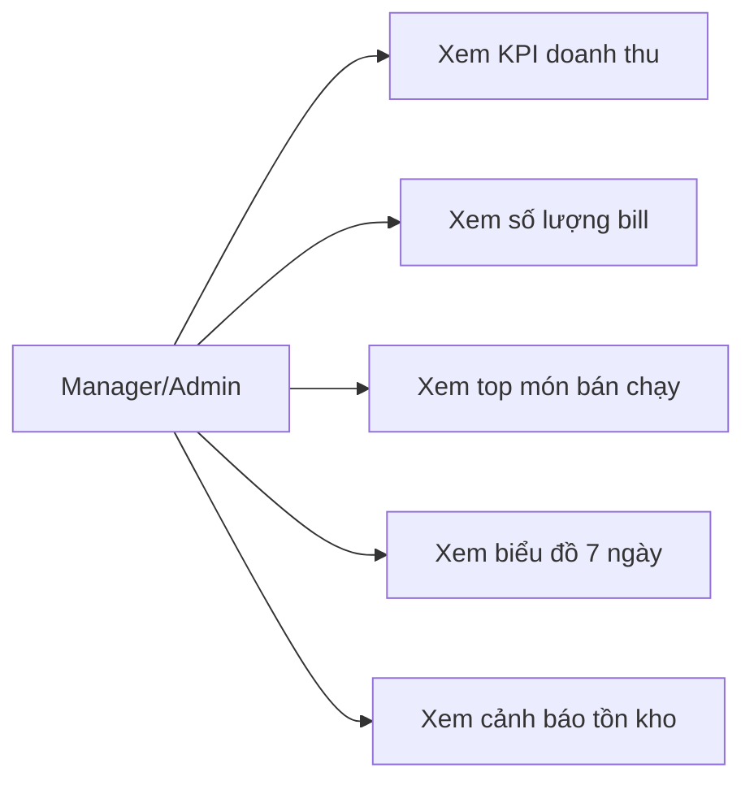

#### 3.7.3 Sơ đồ tuần tự (Sequence)

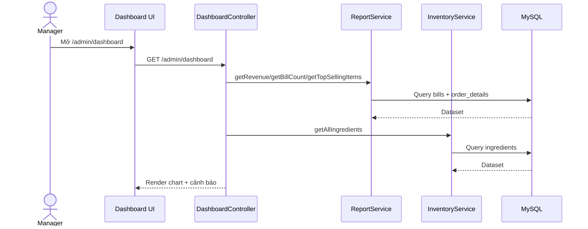

#### 3.7.4 Mô tả giao diện
- Card KPI doanh thu tháng, số bill tháng.
- Biểu đồ doanh thu 7 ngày gần nhất.
- Biểu đồ top món bán chạy.
- Bảng cảnh báo nguyên liệu dưới ngưỡng.

#### 3.7.5 Mô tả chi tiết dữ liệu

| Tên tiếng Việt | Tên tiếng Anh | Loại | Bắt buộc | Mô tả |
|---|---|---|---|---|
| Doanh thu kỳ | revenue | Decimal | Có | Tổng totalAmount bill PAID |
| Số hóa đơn | billCount | Long | Có | Số bill PAID theo kỳ |
| Top món | topItems | Map<String,Integer> | Có | Tên món và số lượng bán |
| Tồn thấp | lowStock | List<Ingredient> | Có | DS nguyên liệu <= ngưỡng |

---

## 4. COMPONENT, THÔNG BÁO, CẢNH BÁO

### 4.1 Bảng thông báo hệ thống

| Loại | Màu chuẩn | Ký hiệu | Ý nghĩa | Ví dụ |
|---|---|---|---|---|
| **THÔNG TIN** | Xanh dương | ⓘ | Cập nhật trung tính | ⓘ Đơn hàng #1024 đang chờ bếp xác nhận |
| **THÀNH CÔNG** | Xanh lá | ✓ | Thao tác hoàn tất | ✓ Thanh toán hóa đơn #B-20260722-01 thành công |
| **CẢNH BÁO** | Vàng/Cam | ⚠ | Cần chú ý ngay | ⚠ Nguyên liệu "Phô mai" sắp hết (<= reorder level) |
| **LỖI NGHIÊM TRỌNG** | Đỏ | ✕ | Giao dịch thất bại hoặc dữ liệu lỗi | ✕ Không thể tạo hóa đơn, vui lòng thử lại hoặc liên hệ quản trị |

### 4.2 Quy tắc hiển thị
- Thông báo phải rõ ràng, có ngữ cảnh (mã bàn, mã đơn, mã hóa đơn).
- Lỗi nghiệp vụ và lỗi hệ thống cần tách thông điệp.
- Với lỗi nghiêm trọng, bắt buộc hiển thị hành động tiếp theo cho người dùng.

> **Lưu ý quan trọng:** Mọi thông báo tài chính (checkout, split bill, refund) phải ghi log để truy vết giao dịch.

---

## 5. LINK ISSUE

| Issue Key | Tiêu đề | Mô tả ngắn |
|---|---|---|
| RMS-101 | Table Layout & Reservation | Xây dựng sơ đồ bàn và thao tác mở/giữ/dọn bàn |
| RMS-102 | Table Order Entry | Gọi món tại bàn, cập nhật món theo bàn |
| RMS-103 | Kitchen Display Workflow | Điều phối trạng thái món trong bếp |
| RMS-104 | POS Billing & Receipt | Thanh toán, in hóa đơn, hỗ trợ VietQR |
| RMS-105 | Inventory Management | Quản lý nguyên liệu, ngưỡng cảnh báo |
| RMS-106 | Menu & Pricing Configuration | Quản lý món, giá, ảnh Cloudinary, công thức |
| RMS-107 | Revenue Dashboard | Doanh thu, số bill, top món, biểu đồ |
| RMS-108 | Voucher Lifecycle | Quản lý mã giảm giá và validate |
| RMS-109 | Shift Opening/Closing | Mở ca/đóng ca và đối soát quỹ |

